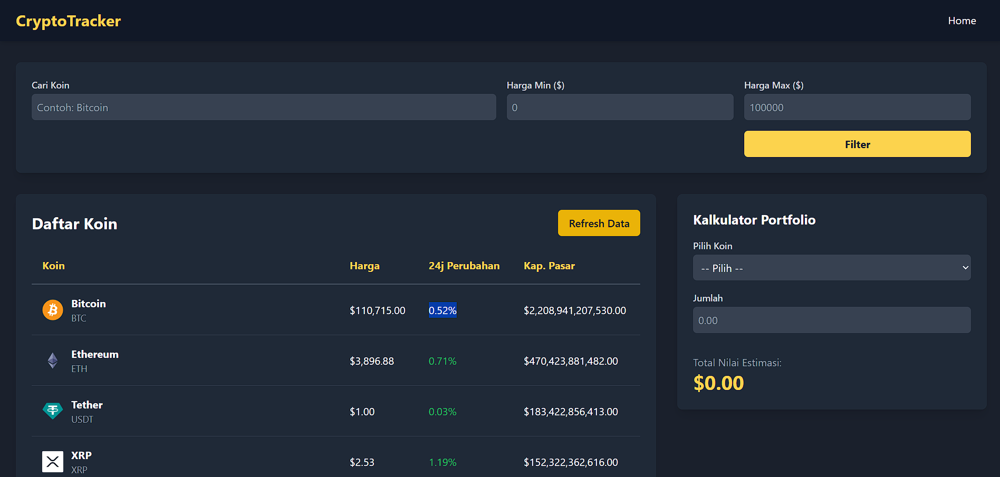
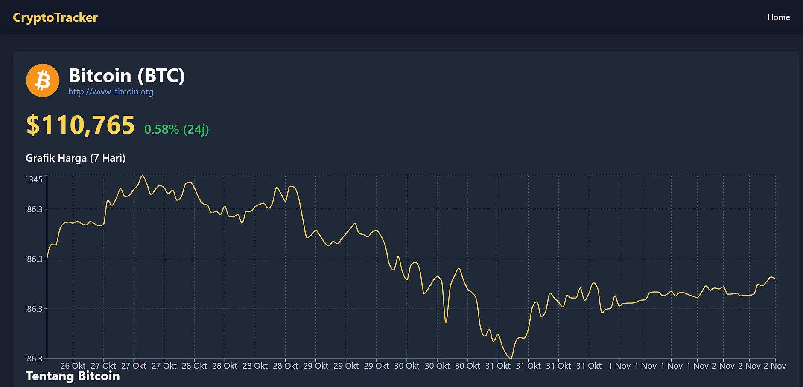

# CryptoTracker

Nama : Muhammad Ghama Al Fajri  
NIM : 123140182  
Sebuah aplikasi web tracker harga *cryptocurrency* yang dapat menampilkan harga-harga koin crypto. Aplikasi ini juga memiliki fitur filter berdasarkan harga, kalkulator portfolio, dan menampilkan grafik untuk koin dalam 7 hari terakhir. Data diambil dari API coingecko.

## Cara Instalasi

1.  **Clone repository**

    ```bash
    git clone [URL_REPOSITORY_ANDA]
    cd [NAMA_FOLDER_PROYEK]
    ```

2.  **Install dependensi**
    Pastikan Anda memiliki Node.js terinstal.

    ```bash
    npm install
    ```

3.  **Jalankan server development**
    Perintah ini akan menjalankan aplikasi dalam mode pengembangan.

    ```bash
    npm run dev
    ```

    Buka [http://localhost:5173](http://localhost:5173) (atau *port* lain yang ditampilkan di terminal) untuk melihatnya di *browser*.

## Link Deployment

Telah dilakukan deployment melalui vercel, untuk hasilnya dapat dibuka di [https://uts-pemweb-123140182.vercel.app/](https://uts-pemweb-123140182.vercel.app/)

## Screenshot

Berikut beberapa screenshot hasil menjalankan web.  



-----
